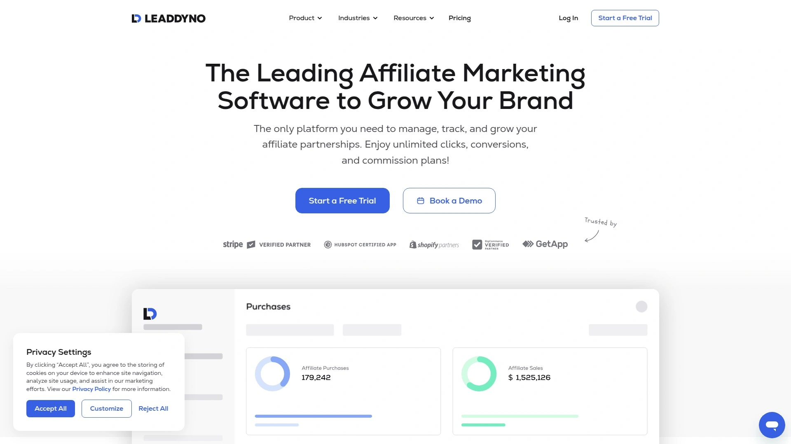

# Top 14 Referral Marketing Platforms in 2025 (Comprehensive Review)

Growing your business through authentic recommendations beats cold advertising every time. Referral marketing platforms automate the entire process of tracking, rewarding, and managing customers who spread the word about your brand. Whether you run an ecommerce store, SaaS startup, or subscription service, these tools handle everything from generating unique sharing links to distributing rewards, letting you focus on delivering great products while your satisfied customers bring in new buyers naturally.

The platforms below support diverse business models and budgets, offering features like fraud detection, customizable reward structures, automated tracking, and seamless integrations with your existing tech stack.

***

## **[ReferralCandy](https://www.referralcandy.com)**

The automated referral engine built specifically for ecommerce brands looking to turn satisfied shoppers into brand advocates.

ReferralCandy sits at the top because it eliminates the technical headaches of running referral campaigns. The platform connects with Shopify, BigCommerce, WooCommerce, and Magento through simple one-click installations, getting you live within an hour. You control exactly what incentives to offer—percentage discounts, dollar amounts, cash through PayPal, free shipping, or custom gifts—and the system automatically generates unique referral links for each customer.

The platform handles both traditional customer referral campaigns and structured programs for influencers or business partners, managing everything from a single dashboard. Built-in fraud detection protects your budget from fake referrals, while detailed analytics show you which advocates drive the most value. The customization options let you match every email, widget, and landing page to your brand identity, so the experience feels native rather than tacked-on.

For ecommerce businesses serious about scaling word-of-mouth growth without hiring a dedicated team, ReferralCandy delivers the automation and flexibility needed to turn occasional referrals into a reliable acquisition channel.

***

## **[Yotpo](https://www.yotpo.com)**

Unified platform combining loyalty programs with referral marketing, designed for brands wanting comprehensive customer retention tools.

Yotpo goes beyond basic referral tracking by integrating loyalty rewards directly into the referral experience. When customers earn points through purchases or reviews, they can immediately share referral links to unlock additional rewards, creating a seamless engagement loop. The platform offers tiered campaigns that provide escalating incentives as advocates refer more customers, keeping top performers motivated over time.

What separates Yotpo is the strategic guidance included—dedicated Customer Success Managers help you set appropriate reward levels, optimize program promotion, and interpret analytics to improve results. The reporting dashboard tracks referral shares, completed conversions, and revenue attribution with full transparency. Integration with Yotpo's review platform means customers who leave positive feedback can be immediately prompted to join the referral program, multiplying your word-of-mouth impact.

BigCommerce and Shopify merchants particularly benefit from Yotpo's deep platform integrations, which enable on-site redemption experiences that feel native to the shopping journey.

***

## **[Talkable](https://www.talkable.com)**

Enterprise-grade referral solution focused on helping established ecommerce businesses achieve measurable revenue growth through sophisticated campaign optimization.

Talkable positions itself for brands ready to treat referral marketing as a core acquisition channel rather than an experiment. The platform emphasizes continuous improvement through A/B testing capabilities that let you compare different incentive structures, messaging variations, and widget placements simultaneously. Customer Success managers function as extensions of your marketing team, conducting regular strategy calls and optimization reviews.

Campaign creation uses pre-built templates with post-purchase overlays, call-to-action widgets, and floating coupon codes that capture attention without disrupting the shopping experience. The fraud protection system identifies suspicious patterns before they impact your budget. Full control over HTML, CSS, and content means technical teams can customize every element to match brand guidelines precisely.

Talkable's pricing reflects its enterprise focus—available upon request rather than self-service tiers—making it most suitable for established brands processing significant transaction volumes who need dedicated support and advanced features.

***

## **[Tapfiliate](https://tapfiliate.com)**

Flexible tracking platform emphasizing ease of use and fast deployment for businesses wanting control over who promotes their products.

Tapfiliate earned its reputation by supporting invite-only referral structures, giving brands complete control over which advocates can access promotional materials. Setup takes half the time of traditional methods, with automated onboarding sequences that get new referrers active quickly. The multilingual dashboard provides referrers with personalized performance insights, tracking links, and brand assets they need to promote effectively.

The platform handles both customer referral campaigns and professional arrangements with influencers or business partners from unified workflows. White-label portal options let you customize branding completely, maintaining consistent visual identity throughout the referrer experience. Integration capabilities extend across major ecommerce platforms and marketing tools, fitting smoothly into existing technology stacks.

Proper onboarding sequences boost referrer performance by roughly 20 percent according to platform data, highlighting why Tapfiliate emphasizes this phase. The automation saves approximately 10 hours weekly on manual management tasks, freeing teams to focus on strategy rather than administrative work.

---

## **[PartnerStack](https://partnerstack.com)**

B2B SaaS partnership ecosystem combining referrals, resellers, and marketing channels into a single management platform with access to over 126,000 active partners.

PartnerStack distinguishes itself by focusing specifically on B2B SaaS distribution rather than serving all business types. The built-in marketplace connects you with thousands of active partners already promoting SaaS products, dramatically reducing the time needed to recruit qualified referrers. You can manage customer referrals, agency partnerships, influencer relationships, and reseller arrangements through one interface rather than juggling multiple tools.

Automated payment processing handles calculations and distributions through a single monthly invoice regardless of partner count, eliminating tedious manual payouts. Custom onboarding journeys provide new partners with training resources and product information tailored to their specific relationship type. The analytics system traces traffic flows and conversion paths back to individual partners, ensuring proper attribution and payment.

Companies using PartnerStack report substantial growth—Monday.com saw 200 percent year-over-year increases in program sales, while Looka grew their active partner count by 600 percent. The platform suits SaaS businesses treating partnerships as a primary growth channel requiring sophisticated infrastructure.

***

## **[FirstPromoter](https://new.firstpromoter.com)**

All-in-one tracking system built specifically for SaaS and subscription businesses needing accurate attribution across recurring billing cycles.

FirstPromoter specializes in handling the complexity of recurring charges and commission adjustments that traditional referral platforms struggle with. Direct integration with Stripe, Chargebee, Braintree, Recurly, and Paddle automatically tracks sales by monitoring billing provider events, eliminating manual entry. The platform supports multi-level marketing structures, letting you reward not just direct referrers but their downstream recruits.

Customizable dashboards give referrers full visibility into their performance with options for CSS and JavaScript modifications to match your brand. Fraud prevention tools protect campaigns from invalid referrals without requiring constant monitoring. Real-time reporting provides 18-plus metrics covering clicks, conversions, customer lifetime value, and attribution paths.

When referrals sign up without using tracking links—perhaps from a different device—you can manually attribute them to the correct promoter, maintaining accurate records. The 60-day default cookie lifespan ensures referrers receive credit even when prospects take time to convert.

FirstPromoter's subscription-focused design makes it particularly valuable for SaaS startups needing professional referral infrastructure without enterprise pricing.

***

## **[Referral Rock](https://referralrock.com)**

Practically done-for-you referral platform emphasizing personalized guidance and hands-on implementation support for businesses wanting expert assistance.

Referral Rock's defining characteristic is the dedicated program advisor assigned to every annual plan customer. This advisor helps with strategy development, program copy creation, reward recommendations based on your target audience, and ongoing optimization throughout your program's lifecycle. The team positions their service as "not 100 percent done for you, but as close as possible while keeping you at the helm".

The platform supports both customer referral campaigns and formal arrangements with outside promoters, accommodating diverse relationship types. One-click sharing enables advocates to spread the word via email, social media, or unique links without friction. Customizable reward structures adapt to different business models and objectives.

Starting at $175 monthly, Referral Rock costs less than many enterprise-focused alternatives while delivering more personalized support than self-service platforms. The HubSpot integration automatically adds referrals to sales funnels, triggers workflows based on referral activity, and issues rewards when CRM records change—all without interrupting existing processes.

This combination of affordable pricing and dedicated human guidance appeals to businesses that value expert input over purely self-service tools.

---

## **[Viral Loops](https://viral-loops.com)**

Specialized platform for creating viral campaigns and referral programs with customizable templates designed to generate exponential growth through social sharing.

Viral Loops focuses on building self-perpetuating growth mechanisms where each new user naturally promotes to others. The platform provides over 100 templates covering different campaign types and objectives, letting you launch quickly without building from scratch. Embed widgets and floating options integrate into your site with minimal technical effort.

Automated referral tracking identifies your most influential advocates so you can boost their efforts strategically. The fraud detection system protects against manipulation when reward stakes are high. Custom styling options ensure widgets match your brand identity rather than appearing generic.

Integration support includes Zapier, Google Analytics, Webhooks, Segment, and Mixpanel, connecting your referral campaigns with existing analytics and marketing infrastructure. Multi-language support in over 20 languages enables global campaigns without manual translation work.

Pricing starts at $49 monthly for up to 1,000 participants, with additional capacity at $20 per 2,000 participants above that threshold. The 14-day free trial lets you test campaign templates before commitment.

***

## **[Ambassador](https://getambassador.com)**

Advanced referral and loyalty platform combining automation with personalization for enterprises needing sophisticated campaign management across multiple program types.

Ambassador enables businesses to run simultaneous referral, influencer, and loyalty marketing initiatives through unified workflows. The platform uses advanced tracking and analytics tools to monitor performance while customizable workflows let you tailor campaigns to specific business needs. Whether managing a small ecommerce operation or multinational enterprise, Ambassador's flexibility and scalability adapt to different organizational sizes.

Unique share links and QR codes simplify distribution for advocates, making it easy to track exactly which promoter drove each referral. The API facilitates integration with WooCommerce, Shopify, SendGrid, Stripe, Mailchimp, and HubSpot, embedding referral functionality into existing systems. SSO capabilities and advanced analytics provide enterprise-grade security and reporting.

Multi-campaign management lets you run different programs simultaneously—perhaps one for customer referrals, another for influencers, and a third for loyalty rewards—without creating organizational chaos. Omnichannel capabilities ensure consistent experiences whether advocates share via email, social media, or direct messaging.

Ambassador suits established organizations treating advocacy marketing as a strategic priority requiring sophisticated infrastructure.

***

## **[Friendbuy](https://www.friendbuy.com)**

Referral and loyalty platform emphasizing seamless integration with customer journey touchpoints, specializing in helping brands reduce acquisition costs dramatically.

Friendbuy's core value proposition centers on acquiring customers at exceptionally low cost per acquisition compared to traditional paid marketing. The platform automatically injects code into Shopify themes and checkout pages, displaying referral and loyalty widgets at optimal moments without manual implementation. Comprehensive A/B testing capabilities let you run concurrent experiments comparing different approaches.

Customizable templates get programs live quickly while maintaining brand consistency. Fraud detection prevents self-referrals and accounts for returns, protecting budget integrity. Integration depth with Klaviyo, Attentive, Okendo, Iterable, and Recharge creates connected experiences across email, SMS, reviews, and subscriptions.

One customer reported a 72 percent increase in referral-driven revenue after working with Friendbuy's Customer Success team to overhaul their program. The team comprises experienced marketing professionals who provide data-driven recommendations for optimization rather than just technical support.

The platform's focus on repeat purchases and customer lifetime value makes it particularly valuable for subscription businesses and brands with high-frequency purchase patterns.

***

## **[LeadDyno](https://www.leaddyno.com)**

User-friendly tracking solution emphasizing fast setup and automated management for businesses wanting to launch referral programs without technical expertise.

LeadDyno positions itself as accessible to non-technical users through guided onboarding and free personalized video support. The platform integrates directly with Shopify, BigCommerce, PayPal, Stripe, HubSpot, Klaviyo, and Zapier through no-code connections. Over 25 direct integrations minimize setup complexity.

Automated functionality handles fraud prevention, link tracking, calculations, and email marketing campaigns without manual intervention. Custom portal options let you apply your brand's colors, logos, domains, and styling for consistent visual identity. Unlimited clicks, conversions, and commission plans mean you can expand programs rapidly without hitting usage caps or incurring overage fees.

Affiliates receive personalized dashboards showing performance insights, tracking links, and brand assets they need for effective promotion. Real-time reporting delivers instant data on visits, leads, and purchases. Mass payment features let you compensate hundreds of referrers in minutes through secure payment integrations.

Starting at $49 monthly, LeadDyno provides entry-level pricing while delivering professional features. The centralized dashboard gives visibility into all marketing metrics from one location.

***

## **[InviteReferrals](https://www.invitereferrals.com)**

Customizable referral marketing software offering tailor-made features and built-in management tools for businesses needing flexible program structures.

InviteReferrals emphasizes customization flexibility, letting businesses adapt referral features to match specific objectives rather than forcing predetermined structures. The platform includes various built-in tools for efficient program management, reducing the need for external applications. Integration with customer engagement platforms enhances user tracking and behavioral analysis.

Businesses can dispatch timely notifications and manage program reminders automatically, keeping advocates engaged without manual outreach. The system tracks participant activities comprehensively, providing insights into which actions drive the most referrals. This data helps optimize reward structures and promotion strategies over time.

The Shopify integration enables quick launch of automated referral campaigns directly from your store admin. Multi-language support and localization options accommodate global audiences. Pricing tiers scale with business size, offering options for startups through enterprise organizations.

InviteReferrals suits businesses that need more customization control than template-based platforms provide but don't require full enterprise-grade infrastructure.

***

## **[ReferralHero](https://referralhero.com)**

AI-powered referral and tracking software featuring advanced automation, deep analytics, and sophisticated fraud prevention for businesses prioritizing data-driven optimization.

ReferralHero leverages artificial intelligence to enhance referral campaign performance through automated optimization suggestions. The platform provides deeper data insights and user behavior analysis compared to basic referral tools, helping identify exactly where to improve. Advanced fraud algorithms work in the background, ensuring only legitimate participants join programs—particularly important when offering high-value rewards.

Powerful email and SMS automation tools keep referrers engaged through strategic touchpoints rather than basic transactional notifications. Full customization capabilities let you integrate referral programs deeply into marketing funnels instead of treating them as separate initiatives. White-label solutions ensure complete brand ownership throughout the referrer experience.

The platform connects with existing marketing stacks through extensive integration options. Campaign manipulation protection gives confidence that growth metrics reflect real performance rather than gaming the system. This comprehensive approach to data security and accuracy appeals to businesses making strategic decisions based on referral program analytics.

ReferralHero suits growth-focused businesses that treat referral data as a key performance indicator requiring sophisticated measurement and optimization tools.

***

## **[Referral Factory](https://referral-factory.com)**

Plug-and-play referral platform offering 100-plus templates and drag-and-drop building for businesses wanting fast deployment without technical requirements.

Referral Factory removes technical barriers through no-code setup using pre-built templates covering diverse campaign types. The drag-and-drop builder lets non-technical team members create professional campaigns quickly. Flexible reward options accommodate different business models and customer preferences.

Automated tracking and analytics provide performance visibility without manual reporting. The platform connects with over 3,000 applications including HubSpot, Salesforce, Zapier, Pipedrive, ServiceTitan, Stripe, and Tremendous. This extensive integration library ensures compatibility with most existing technology stacks.

Access to 100,000-plus potential advocates through the platform's network accelerates program growth beyond your existing customer base. Dedicated customer support provides guidance when needed. Multi-language support in over 20 languages enables international programs without translation overhead.

The platform suits businesses prioritizing speed to launch over deep customization, particularly those without dedicated technical resources for implementation. Template variety means most industries can find relevant starting points rather than building from scratch.

***

## How do I choose between customer referral and professional partner programs?

Customer referral programs work best when you have satisfied buyers who naturally recommend products to friends. Professional partner arrangements make sense when influencers, bloggers, or complementary businesses want ongoing relationships promoting your brand. Many platforms like ReferralCandy and Tapfiliate support both types simultaneously, letting you test what drives better results for your specific business.

## What referral rewards actually motivate people to share?

Percentage discounts between 10-30 percent, dollar amounts matching your average order value, cash payments through PayPal, or free products all perform well depending on your audience. Test different incentive structures—some customers prefer immediate discounts while others respond better to cash. Tiered rewards that increase as advocates refer more customers often boost long-term participation.

## How quickly can I launch a functional referral program?

Most platforms get you operational within a few hours to a couple days. ReferralCandy integrates with major ecommerce platforms in under an hour, while Tapfiliate reduces setup time by 50 percent compared to manual methods. Platforms offering dedicated advisors like Referral Rock provide hands-on implementation support, speeding deployment while ensuring strategic soundness.

***

## Conclusion

Each platform above handles the mechanics of referral tracking and reward distribution, but your choice depends on whether you need ecommerce-specific features, SaaS billing integration, enterprise-grade optimization, or hands-on implementation support. **[ReferralCandy](https://www.referralcandy.com)** remains the strongest option for ecommerce businesses because it eliminates technical complexity while automating everything from customer invitation through reward fulfillment, letting you build a sustainable acquisition channel without hiring specialized teams. The platform's combination of speed to launch, deep ecommerce integrations, and comprehensive automation makes it particularly suitable for online retailers ready to transform satisfied customers into consistent revenue drivers.
